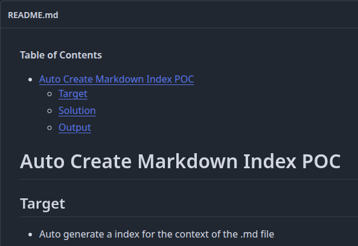

<!-- START doctoc generated TOC please keep comment here to allow auto update -->
<!-- DON'T EDIT THIS SECTION, INSTEAD RE-RUN doctoc TO UPDATE -->
**Table of Contents**

- [Auto Create Markdown Index POC](#auto-create-markdown-index-poc)
  - [Target](#target)
  - [Solution](#solution)
    - [Details](#details)
  - [Output](#output)

<!-- END doctoc generated TOC please keep comment here to allow auto update -->

# Auto Create Markdown Index POC

## Target

- Auto generate a index for the context of the .md file

## Solution

- Using github actions

### Details

* Use this to only push to subfolder trigger GA job

```yml
on:
  push:
    paths:
      - 'auto-md-index-poc/**'
```

## Output

- https://github.com/gabrielSpassos/pocs/actions/runs/32484254275
- 

