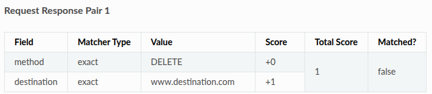
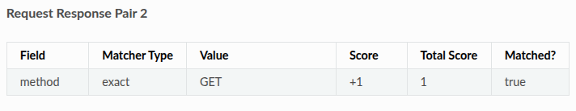
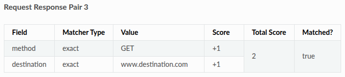
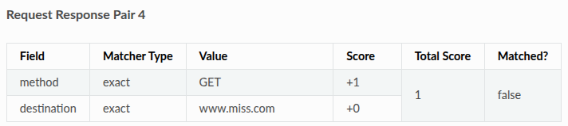

<!-- START doctoc generated TOC please keep comment here to allow auto update -->
<!-- DON'T EDIT THIS SECTION, INSTEAD RE-RUN doctoc TO UPDATE -->
**Table of Contents**

- [Matching Stategies](#matching-stategies)
  - [Strongest Match](#strongest-match)
    - [Matching scores](#matching-scores)
  - [First Match](#first-match)

<!-- END doctoc generated TOC please keep comment here to allow auto update -->

## Matching Stategies

* Two modes "strongest match" and "first match" 

### Strongest Match

* Default mode
* if multiple Request Response Pairs matches the incoming request will return the response with highest matching score.

#### Matching scores

* Each request matcher counts as points
* The Request Responses Pairs that was more points is the one that the response will return
* 
    * destination match
    * method does not match
* 
    * method match
* 
    * destination match
    * method match
* 
    * destination does not match
    * method match
* Request Pair 3 with highest score is the selected one

### First Match

* Legacy mode
* First match found will be returned
* `hoverctl mode simulate --matching-strategy=first`
* More performance, harder debug on matching errors