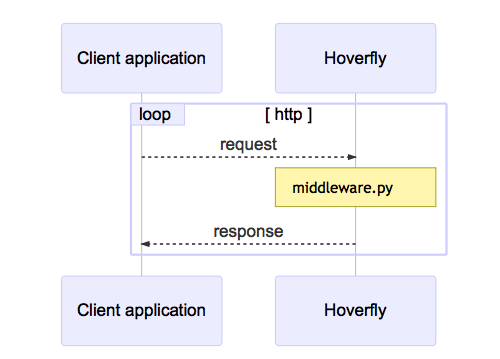
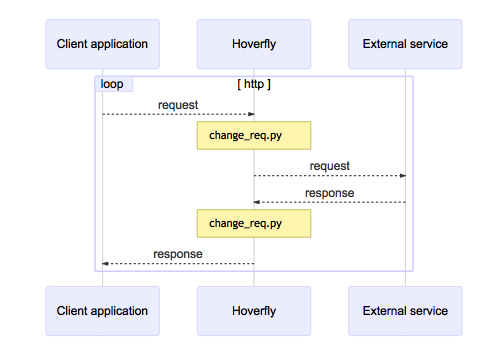

<!-- START doctoc generated TOC please keep comment here to allow auto update -->
<!-- DON'T EDIT THIS SECTION, INSTEAD RE-RUN doctoc TO UPDATE -->
**Table of Contents**

- [Hoverfly Modes](#hoverfly-modes)
    - [Capture Mode](#capture-mode)
    - [Simulate Mode](#simulate-mode)
    - [Spy Mode](#spy-mode)
    - [Synthesize Mode](#synthesize-mode)
    - [Modify Mode](#modify-mode)
    - [Diff Mode](#diff-mode)

<!-- END doctoc generated TOC please keep comment here to allow auto update -->

## Hoverfly Modes

#### Capture Mode

- Used for API simulations
- Can't be used when is webserver, only as a proxy
- intercepts communication between the client application and the external service.
- records the request and response
- once the capture is done, could replace the external service
- By default, Hoverfly will ignore duplicate requests if the request has not changed. 
    - This can be a problem when trying to capture a stateful endpoint that may return a different response each time you make a request.
    - stateful mode can solve this issue

#### Simulate Mode

- Uses the simulate data, to simulate the external API
- When receive the request, instead of send the request to the external API will respond the client
- No network traffic will reach the external API
- Simulation can be created by running the capture mode or manually

#### Spy Mode

- Will simulate the external API only if the request matches is found on simulate data
- If does not found a match will forward the request to the real external API

#### Synthesize Mode

- Similar to simulate mode
- Instead of reply with simulate data response, will use an user-supplied file
- These files are named as "Middleware"
- The middleware will generate the response "on the flight"
- Usefull for simulate API that are hard to record the response at capture mode 

#### Modify Mode

- Similar to capture, but will NOT save request and response
- Can't be used when is webserver, only as a proxy
- Will pass each request to a "middleware" script before forward to external service
- Will pass each response to a "middleware" script before forward to client
- Can use these middleware to update something on request or response

#### Diff Mode

- Send the request to external service
- Compare the response vs a stored simulation
- Hoverfly detects differences between real response and the stored one
- Hoverfly stores de difference, and foward the real response
- Diff can be fetch via API `GET /api/v2/diff`
- Diff is keep until Hoverfly is stopped or storage is cleaned
    - to clean use API `DELETE /api/v2/diff`