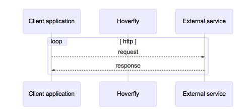
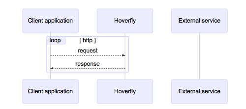

## Hoverfly Modes

#### Capture Mode

- Used for API simulations
- Can't be used when is webserver, only as a proxy
- intercepts communication between the client application and the external service.
- records the request and response
- once the capture is done, could replace the external service
- By default, Hoverfly will ignore duplicate requests if the request has not changed. 
    - This can be a problem when trying to capture a stateful endpoint that may return a different response each time you make a request.
    - stateful mode can solve this issue

#### Simulate Mode

- Uses the simulate data, to simulate the external API
- When receive the request, instead of send the request to the external API will respond the client
- No network traffic will reach the external API
- Simulation can be created by running the capture mode or manually

#### Spy Mode

- Will simulate the external API only if the request matches is found on simulate data
- If does not found a match will forward the request to the real external API