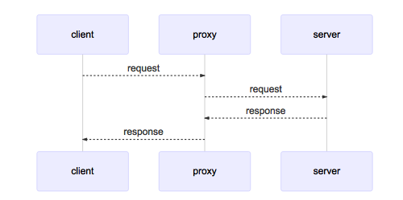

## Hoverfly proxy server

* Proxy server passes requests between client and server
* A proxy server is a type of webserver
    * webserver will receive a request from the client and will reply with some response
    * proxy server will pass the incoming request to another server, adding some headers on the request, and once the proxy receives the response from the destination should pass back to the client.
        * Headers: X-Forwarded-For, X-Real-IP, X-Forwarded-Proto

