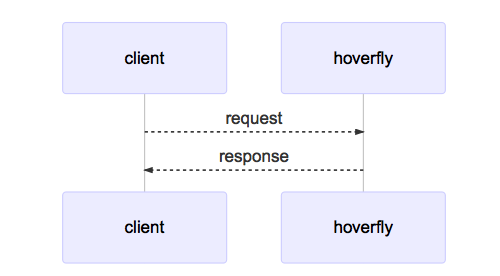

<!-- START doctoc generated TOC please keep comment here to allow auto update -->
<!-- DON'T EDIT THIS SECTION, INSTEAD RE-RUN doctoc TO UPDATE -->
**Table of Contents**

- [Hoverfly web server](#hoverfly-web-server)

<!-- END doctoc generated TOC please keep comment here to allow auto update -->

## Hoverfly web server

* If at the client you can't configure to use a proxy or other reason you can use hoverfly as a web server
* Support only `Simulate mode` and `Synthesize mode`
    * NOT support `Capture mode`
* Imagine that you would call `http://echo.jsontest.com/key/value`
    * hoverfly is running in simulate mode as webserver at `http://localhost:8888`
    * to retrieve data from hoverfly is `http://localhost:8500/key/value`

